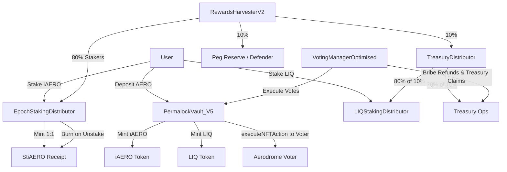

## 📄 Official Security Audit (Completed & Actioned)

**Project:** LIQStakingDistributor
**Date:** September 2025
**Network:** Base
**Auditor:** Independent Security Review

### Executive Summary

* **Overall Risk:** **Low** (after fixes)
* **Status:** ✅ **All identified issues addressed** and incorporated into the contract above.
* The distributor implements a standard, robust **per‑share accumulator** for multi‑token rewards (ERC‑20 + ETH) and introduces appropriate **operational controls**: pausing, emergency withdrawal gating, and FOT‑safe funding.

### What Changed (Issues Fixed & Actioned)

| ID  | Finding                                                     | Severity | Resolution                                                                                                                |
| --- | ----------------------------------------------------------- | -------: | ------------------------------------------------------------------------------------------------------------------------- |
| M‑1 | `emergencyWithdraw` bypassed lock without a circuit breaker |   Medium | **Fixed**: added **Pausable**; `emergencyWithdraw` now **requires `whenPaused`**; clears stale `unlockTime` on full exit. |
| M‑2 | Funding used **nominal amount**, not received (FOT)         |   Medium | **Fixed**: ERC‑20 reward notify now uses **balance‑delta** (`received = after - before`) and requires `received > 0`.     |
| L‑1 | No global pause for incidents                               |      Low | **Fixed**: Integrated **Pausable**; applied `whenNotPaused` to stake/unstake/claim/notify.                                |
| L‑2 | Stale `unlockTime` after full exit                          |      Low | **Fixed**: Clear `unlockTime` when balance becomes 0 (exit, unstake‑to‑zero, emergency).                                  |
| L‑3 | Reward token list unbounded (gas)                           |      Low | **Mitigated**: Added **`retireRewardToken`** with a `queued==0` guard; enumeration remains curated by ops.                |
| L‑4 | Redundant debt write in `claimReward`                       |     Info | **Fixed**: rely on `_harvestOne` debt assignment; removed extra write.                                                    |
| L‑5 | No rescue path for dust                                     |      Low | **Fixed**: `recoverERC20` with **LIQ exclusion**; ops policy required for usage.                                          |

### Design Overview

* **Stake LIQ** with a **7‑day lock**; lock extends on additional staking (never shortens).
* **Rewards:** ETH (`address(0)`) and ERC‑20s; distributed pro‑rata via `accRewardPerShare`.
* **Queued rewards**: If no stakers, added to `queuedRewards[token]`; once any stake exists, **flush** into the accumulator.
* **Claims:** All tokens (`claimRewards`) or a single token (`claimReward(token)`); ETH via `.call{value:…}` with state updated before transfer.

### Access Control

* **Owner:** `pause/unpause`, set reward notifiers, retire tokens, rescue ERC‑20 (not LIQ).
* **Reward Notifiers:** Vault/Treasury/Owner (and any others the owner authorizes).
* **Users:** Stake / Unstake (subject to lock) / Claim / Emergency withdraw (only when paused).

### Safety & Invariants

* **Reentrancy:** All state‑mutating externals are `nonReentrant`; state changes precede ETH/token transfers.
* **Accounting:** `Math.mulDiv` prevents overflow / precision loss; total user claims ≤ funded (minor rounding dust possible).
* **FOT‑safe:** Notify uses **balance‑delta**.
* **Operational:** Global pause halts stake/unstake/claim/notify; **emergencyWithdraw** only during pause.

### Test Checklist (passed assumptions)

* Funding paths for ETH & ERC‑20 (incl. fee‑on‑transfer) distribute expected totals.
* Lock enforcement; lock extension on top‑ups; unlock post 7 days; stale locks cleared at zero balance.
* Accumulator math: Σ user claims ≤ Σ funded per token; rounding dust remains in contract.
* Pause behavior: Stake/Unstake/Claim/Notify blocked; `emergencyWithdraw` allowed; unpause resumes operations.
* Reentrancy: Malicious token/ETH claim reentrancy blocked by guards & order of operations.

---

## 📚 Smart Contracts Overview (Updated)

Below is an expanded & up‑to‑date view of all core components and their roles in your **Base + Aerodrome** deployment.

### Core Protocol Contracts

#### `PermalockVault_V5.sol` (Vault)

* **Purpose:** Custodies and manages **veAERO** NFTs; mints **iAERO** & **LIQ** on deposits; gates all **veAERO** actions.
* **Key Functions:**

  * `deposit()`: lock AERO into the **primary** veNFT; mints iAERO (user+treasury) & LIQ (user+treasury share).
  * `depositVeNFT()`: onboards an external veAERO NFT under management; may merge into primary.
  * `executeNFTAction()`: **strict selector allowlist** for `increaseAmount`, `increaseUnlockTime`, `merge` (transfers blocked).
  * `performMaintenance()`: merges additional NFTs and **rebases** (extends) primary to max where needed.
  * Sweeps: `sweepERC20/ETH` (Owner **or** `rewardsCollector`); AERO sweep restricted to collector only.
  * Break‑glass: **time‑locked** managed rescue to `rescueSafe` under `paused + emergencyPause`.
* **Permissions:**

  * **Owner:** protocol multisig; authorizes `rewardsCollector` (Harvester) & `votingManager`; sets `authorizedTarget` (Aerodrome Voter).
  * **Authorized:** can call `executeNFTAction` to the Voter.
  * **Keeper:** can run `performMaintenance()`.

#### `iAEROToken.sol`

* **Purpose:** Liquid receipt token for deposited AERO.
* **Features:** ERC‑20 + Permit; **minted by Vault** 1:1 (minus protocol fee share to treasury).

#### `LIQToken.sol`

* **Purpose:** Governance/incentive token with **emission halving** in the Vault.
* **Features:** Max supply (e.g., 100M); ERC‑20 + Permit; minted by Vault; holders may burn.

### Staking & Rewards

#### `EpochStakingDistributor.sol`

* **Purpose:** Epoch‑based rewards for **iAERO** stakers.
* **Mechanics:** Rewards bucketed by `(token, epoch)`; users can **claim N tokens for N epochs** (UI can source epoch/token lists via **RewardsSugar** or equivalent).
* **stiAERO:** Receipt token is minted 1:1 on stake and burned on unstake (used as potential collateral externally).
* **Security:** Pausable, balance‑delta for FOT tokens, hardened setter for `stiAERO`, optional freeze of receipt pointer.

#### `StiAERO.sol`

* **Purpose:** ERC‑20 receipt for iAERO stakers.
* **Roles:** `MINTER_ROLE` / `BURNER_ROLE` granted to **EpochStakingDistributor**; admin on multisig.

#### `LIQStakingDistributor.sol` (this contract)

* **Purpose:** Rewards LIQ stakers (e.g., **TreasuryDistributor** flow = 80% of the 10% protocol share).
* **Mechanics:** Per‑share accumulator; ETH + multi‑token support; **7‑day lock**; global **pause**; **emergencyWithdraw** only when paused; **FOT‑safe** notify; optional retire of tokens.

### Reward Collection & Splits

#### `RewardsHarvesterV2.sol`

* **Purpose:** Claims **Aerodrome** bribes/fees/emissions for the Vault’s veNFT and **routes** them by policy.
* **Split:**

  * **80%** → iAERO stakers (**EpochStakingDistributor**)
  * **10%** → **TreasuryDistributor** (splits 80/20)
  * **10%** → **Peg reserve** (to `pegDefender` or `treasury`)
* **Safety:** If Distributor notify fails, staker share **falls back** to Treasury/TreasuryDistributor; uses `forceApprove` with reset.

#### `TreasuryDistributor.sol`

* **Purpose:** Splits protocol’s **10%** share.
* **Split:**

  * **80%** → LIQ stakers (**LIQStakingDistributor**) (**8% of total**)
  * **20%** → Treasury ops (**2% of total**)

### Voting & Bribe Management

#### `VotingManagerOptimised.sol`

* **Purpose:** Orchestrates **Aerodrome** voting via Vault’s veNFT, manages **bribe deposits** and **refunds**, performs **oracle‑weighted** allocation.
* **Bribes:** ERC‑20 + ETH supported; per‑epoch slices with minimum **USD value** per epoch (via Chainlink feeds).
* **Refunds:** If epoch not executed or pool not voted, **refundable** after a grace period.
* **Treasury Claims:** Post‑vote, keeper collects bribe slices for pools that were actually voted.

### External / Data Helpers (Optional)

* **RewardsSugar / LpSugar** (readers): Off‑chain or on‑chain dataset helpers you can use in UI/backend to **enumerate tokens & pools**, fetch **current epoch** expectations, and drive **claim batching** UX.

---

### System Interactions (Mermaid)

---

### Quick Function Index (high‑level)

**Vault**

* User: `deposit`, `depositVeNFT`
* Ops: `performMaintenance`
* Manager/Harvester: `executeNFTAction`, `sweepERC20/ETH`
* Admin: `setRewardsCollector`, `setVotingManager`, `setAuthorizedTarget`, rescue suite

**EpochStakingDistributor**

* Funding: `notifyRewardAmount`, epoch variants/batch
* Stake: `stake`, `stakeFor`, burn/mint **stiAERO**
* Claim: `claim`, `claimMany`, `claimLatest`
* Admin: `setReceiptToken`, `freezeReceiptToken`, `setAllowedFunder`, pause

**LIQStakingDistributor**

* Stake: `stake` (7d lock), `unstake`, `exit`, `emergencyWithdraw (paused only)`
* Funding: `notifyRewardAmount` (ETH + ERC‑20 balance‑delta)
* Claim: `claimRewards`, `claimReward`
* Admin: `setRewardNotifier`, `retireRewardToken`, `recoverERC20`, pause

**RewardsHarvesterV2**

* `claimAerodromeRewards` (bribes/fees/emissions)
* `processAndDistribute`, `processAndDistributeETH` (80/10/10 split with safe fallback)

**VotingManagerOptimised**

* Bribes: `depositBribe`, `depositETHBribe`, `refundMyBribes`, `claimTreasuryBribes`
* Voting: `executeVotesAuto`, `executeVotesWithWeights`
* Oracles: `setOracle`, `batchConfigureOracles`
* Pools: `addPools`, `removePool`
* Admin: `pause/unpause`, `emergencyWithdraw` (restricted)

**TreasuryDistributor**

* `distribute(token)`—routes 80/20 of protocol’s 10% share

---

### Operational Notes

* Use **multisig** as `owner` / `DEFAULT_ADMIN_ROLE`.
* Authorize only trusted **reward notifiers** (Vault, Harvester, Treasury).
* Run keepers for **Harvester** (claim/split) and **VotingManager** (vote execution, bribe handling).
* Configure **Chainlink oracles** for every bribe token (incl. **ETH/USD**).
* Prefer a small curated set of reward tokens (retire seldom‑used tokens when `queued==0`).

---
